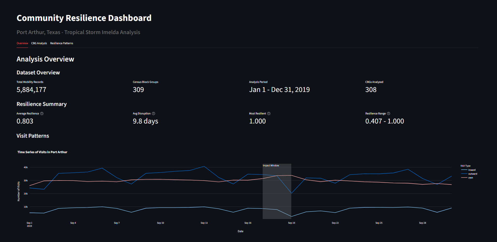
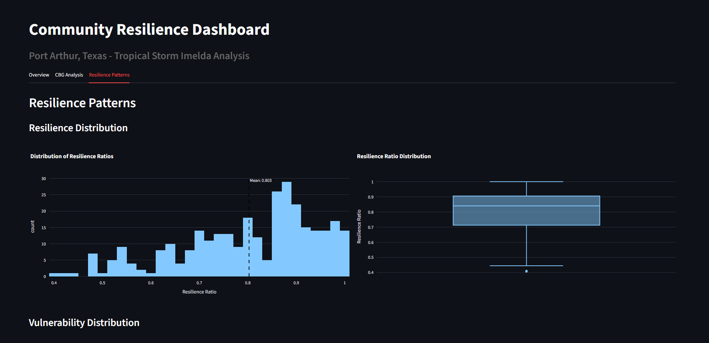
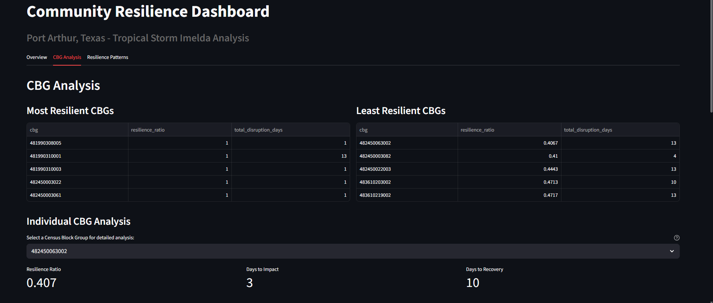
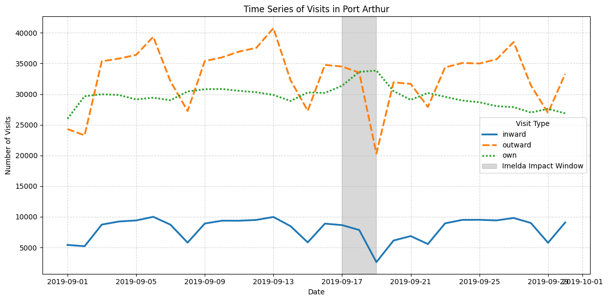
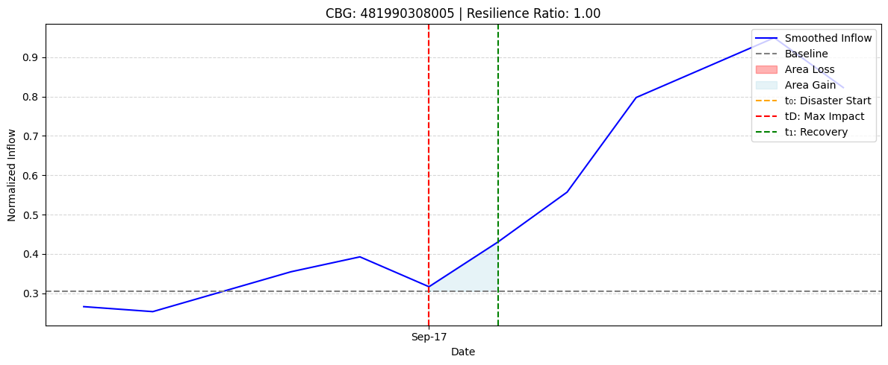
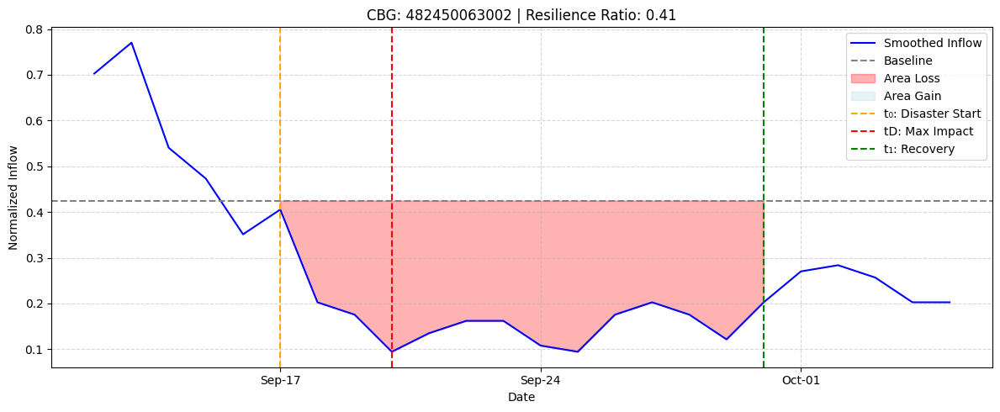

# Community Resilience Analysis

A system for analyzing community resilience using mobility data and the resilience triangle methodology. This project quantifies how communities respond to and recover from disasters by analyzing human mobility patterns before, during, and after disaster events.

## Overview

This analysis system implements the resilience triangle approach to measure community resilience using large-scale mobility data.

**Case Study**: Port Arthur, Texas - Tropical Storm Imelda (September 2019)
- Dataset: 5.8+ million mobility records
- Analysis Period: January 1 - December 31, 2019
- Geographic Coverage: 309 Census Block Groups




## Installation

### Setup

1. **Clone the repository**
   ```bash
   git clone https://github.com/ShivamMishra1603/mobility-based-resilience-analysis
   cd mobility-based-resilience-analysis
   ```

2. **Create virtual environment**
   ```bash
   python -m venv .venv
   source .venv/bin/activate  # On Windows: .venv\Scripts\activate
   ```

3. **Install dependencies**
   ```bash
   pip install -r requirements.txt
   ```

4. **Prepare data**
   - Place your `.rdata` file in the `data/` directory
   - Update the `DATA_FILE` path in `config/analysis_config.py`

## Usage

### Running the Dashboard

Launch the interactive web dashboard:

```bash
streamlit run dashboard.py
```

The dashboard will be available at `http://localhost:8501`

### Running Individual Modules

**Data Processing:**
```bash
python src/data_loader.py
python src/mobility_processor.py
```

**Resilience Analysis:**
```bash
python src/resilience_calculator.py
```

**Visualization:**
```bash
python src/plotter.py
```

### Configuration

Edit `config/analysis_config.py` to modify:
- Disaster dates and analysis periods
- Data file paths
- Processing parameters


## Methodology

### Mobility Data Processing

1.  **Weighted Inflow Calculation:** Mobility data is processed to calculate daily inflow, representing the total number of incoming visits to each Census Block Group (CBG) per day..
2.  **Trend Extraction and Normalization:** The daily inflow data is then smoothed using a 3-day centered rolling average to extract mobility trends.


### Resilience Triangle Approach

The system implements a quantitative resilience analysis based on the resilience triangle methodology:

1. **Baseline Calculation**: Average normalized mobility before disaster
2. **Disaster Onset (t₀)**: Official disaster start date
3. **Maximum Impact (tD)**: Date of lowest mobility after disaster onset
4. **Recovery Point (t₁)**: First date when mobility returns to baseline levels

### Key Metrics

- **Resilience Ratio**: `1 - (area_loss / area_baseline)` (higher = more resilient)
- **Vulnerability**: Rate of initial impact decline
- **Robustness**: Rate of recovery from lowest point
- **Recovery Time**: Total days from disaster onset to recovery

### Data Processing Pipeline

1. **Data Loading**: Read R data files and convert data types
2. **Date Conversion**: Transform day-of-year to proper datetime format
3. **Mobility Aggregation**: Calculate daily inflow by Census Block Group
4. **Smoothing**: Apply 3-day rolling window to reduce noise
5. **Normalization**: Min-max scaling within each CBG
6. **Resilience Calculation**: Apply resilience triangle methodology


## Technologies Used

- **Python**: Core analysis and processing
- **Pandas**: Data manipulation and analysis
- **Streamlit**: Interactive web dashboard
- **Plotly**: Interactive visualizations
- **Matplotlib/Seaborn**: Static plotting
- **pyreadr**: R data file reading
- **NumPy**: Numerical computations


## Results

The system generates comprehensive visualizations and analysis outputs showcasing community resilience patterns during disaster events.

### Dashboard Interface




The interactive dashboard provides an intuitive interface for exploring resilience metrics, featuring:
- Real-time data processing and analysis
- Interactive charts and visualizations
- Comprehensive statistical summaries
- Clean, professional interface design

### Visit Pattern Analysis



Time series analysis reveals how different types of mobility (inward, outward, own) change during disaster periods:
- Clear disruption patterns during Tropical Storm Imelda impact window
- Distinctive recovery trajectories for different visit types
- Visual identification of disaster impact timing and duration

### Community Resilience Comparison

**Most Resilient Communities:**



Communities with high resilience ratios demonstrate:
- Minimal functionality loss during disaster
- Quick recovery to baseline levels
- Stable mobility patterns throughout the crisis

**Least Resilient Communities:**



Communities with low resilience ratios show:
- Significant and prolonged mobility disruption
- Extended recovery periods
- Greater vulnerability to disaster impacts


